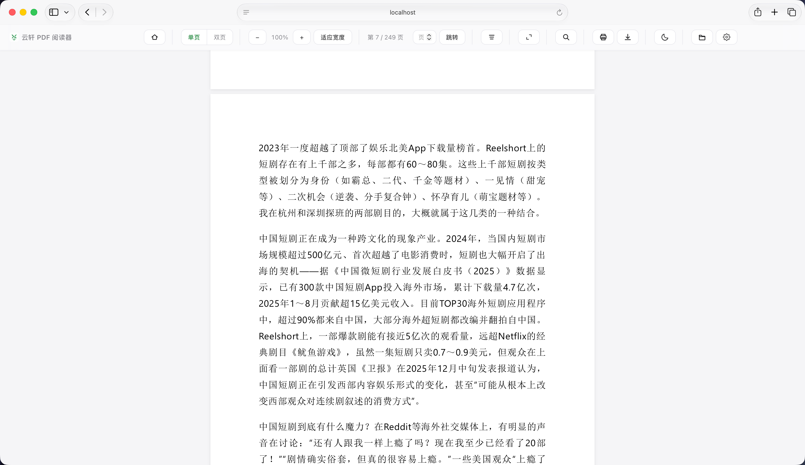
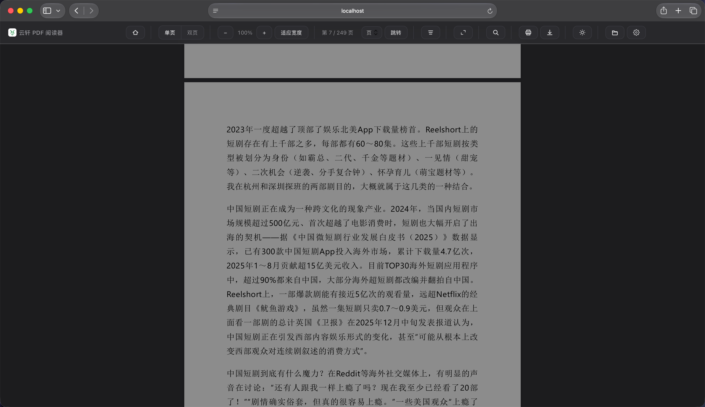
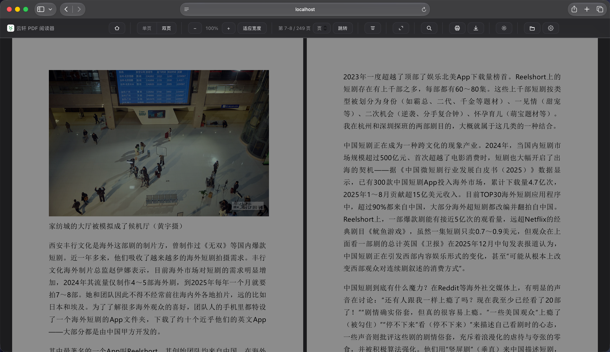
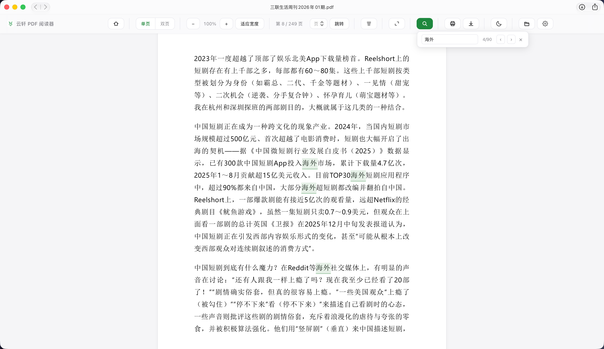
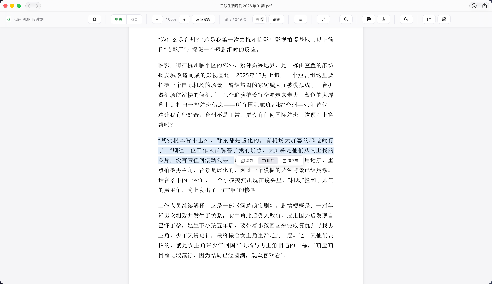
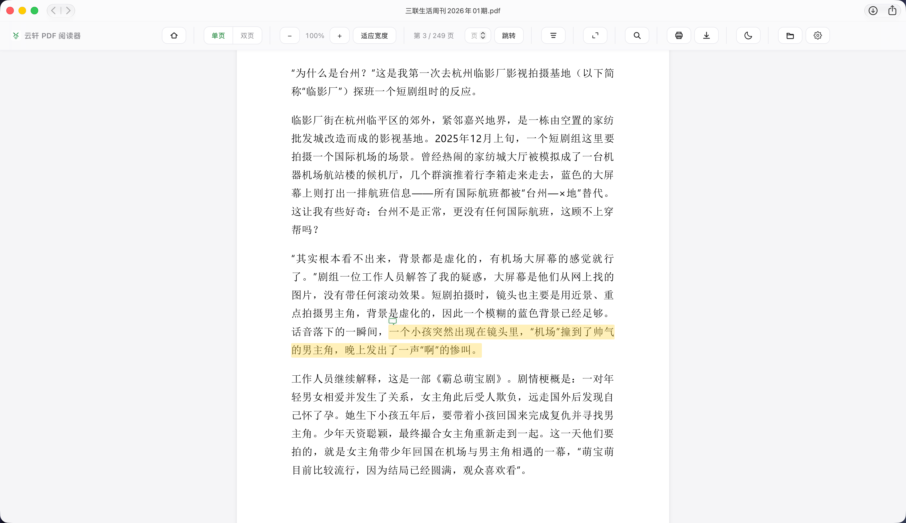

# 云轩 PDF 阅读器

> 网页版 PDF 阅读器 · 纯本地运行 · 零服务器上传

一个基于 pdf.js 的纯前端 PDF 阅读器，所有文件在浏览器本地处理，**不会上传到任何服务器**。

## 功能

**阅读** — 单页连续滚动 / 双排对开页一键切换、缩放、全屏、页码跳转  
**工具** — 全文搜索、目录侧栏、上次阅读位置记忆（支持自动跳转）、打印  
**批注** — 选中文字 → 复制或添加批注，黄色高亮 + 气泡，悬停查看/点击编辑  
**去水印** — 一键检测并批量删除水印（文本 / 注释 / 对象水印），源文件不受影响，结果按文件缓存  
**个性化** — 暗色/亮色模式、最近打开（10 条）、设置菜单（可隐藏 PDF 内嵌批注）

## 优势

**即开即用** — 无需安装 App，浏览器打开即阅读，Mac / Windows / Linux / iPad 全平台兼容  
**隐私安全** — 所有文件在本地处理，不上传任何数据到服务器  
**去水印（免费）** — 内置免费去水印能力，识别常见水印类型一键批量清除，无需第三方工具  
**开机自启** — 运行一次安装脚本，之后自动启动，跟原生 App 一样方便  
**零配置** — 依赖自动安装，一行命令搞定

## 去水印（免费）

点击工具栏「去水印」图标，自动检测水印并一键批量删除，全程本地处理、**免费**。

**支持的水印类型**
- **文本水印** — 页面中直接绘制的文字水印（如「添加微信 xxx」「www.xxx.com」），按跨页出现位置自动识别
- **注释水印** — PDF 注释层的 Stamp / Text / FreeText 水印对象
- **对象水印** — 以 XObject 对象引用的水印（常见于电子杂志 / 排版工具导出，会整体清空其内容）

**适用场景**
- 网上流传的电子杂志 / 期刊 / 文档中带有的推广水印（如 Readle 电子杂志的「添加微信：…，进杂志群」）
- 正文文字与页眉页脚水印分离的文档，可精确删除水印而不影响正文
- 多页文档中固定位置重复出现的水印（封面 / 目录 / 正文位置略有偏移也能识别）

**使用方式**
1. 打开 PDF → 点「去水印」→ 自动检测（显示检测数量与类型）
2. 点「立即去水印」→ 实时进度 → 完成后关闭弹框查看效果
3. 点导航栏「下载」保存无水印版

**设计细节**
- **源文件永不被改动**：处理结果保存在本地缓存（按文件隔离），再次打开自动加载无水印版
- **可恢复**：随时可从去水印弹框「恢复原始文件」，释放缓存回到带水印原版
- **无批注损失**：处理水印的同时，你添加的批注 / 修正带会一并写入下载文件

**暂不支持的场景**
- 图片水印（以图片形式平铺的水印 logo）
- 加密 / 受密码保护的 PDF
- 扫描件（水印与正文混在同一张图片里）

## 预览

**亮色模式**



**暗色模式**



**双页显示**



**搜索高亮**



**添加批注**



**批注注释**



## 快速开始

```bash
git clone https://github.com/renhairong/PDF-Reader.git
cd PDF-Reader
npm install
./install-service.sh          # 开机自启，访问 http://localhost:8137
```

也可双击 `start.command` 手动启动。

## 更新

```bash
git pull
```

拉取最新代码后刷新浏览器即可，无需重启服务。

## 卸载开机自启

```bash
./install-service.sh --remove
```

## 技术栈

pdf.js · 原生 JavaScript 单页 · IndexedDB + localStorage · Python http.server

MIT © mrleocc
